# PawPal AI Pet-Care Scheduling Agent

PawPal AI turns natural-language pet-care requests into safe, prioritized daily schedules. It combines retrieval over local pet-care notes, a Gemini-backed parser with deterministic fallback, guardrails for medical and emergency language, and the original PawPal deterministic scheduler.

## Original Project

This project extends **PawPal+**, a Python and Streamlit pet-care scheduling app from Module 2. The original app let users add owners, pets, and care tasks, then generated a daily schedule using deterministic priority, duration, recurrence, and conflict-detection logic.

## Final System Summary

The final version adds an applied AI workflow on top of the scheduler:

- RAG retriever over local markdown knowledge files in `knowledge/`
- Gemini structured-output parser when `GEMINI_API_KEY` is available
- Deterministic fallback parser when Gemini is unavailable
- Guardrails for invalid plans, medical language, and emergency language
- Scheduler adapter that converts AI JSON into PawPal `Owner`, `Pet`, and `Task` objects
- JSONL logging in `logs/pawpal_runs.jsonl`
- Pytest unit tests and `eval_cases.py` reliability harness

## Architecture

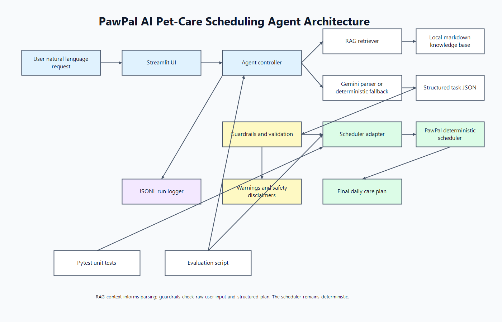

Data flow:

1. The user enters a natural-language pet-care request in Streamlit.
2. The agent retrieves relevant local pet-care context.
3. Gemini parses the request into structured JSON, or the fallback parser does so deterministically.
4. Guardrails validate the plan and add safety warnings.
5. The scheduler adapter converts JSON into PawPal system objects.
6. The deterministic scheduler produces the final care plan.
7. The app logs the run and displays agent steps, context, warnings, and schedule output.

## Setup

```bash
python -m venv .venv
```

Windows:

```bash
.venv\Scripts\activate
```

macOS / Linux:

```bash
source .venv/bin/activate
```

Install dependencies:

```bash
pip install -r requirements.txt
```

## Environment Variables

Gemini is optional. Without an API key, the app still works through the deterministic parser.

```bash
set GEMINI_API_KEY=your_key_here
```

PowerShell:

```powershell
$env:GEMINI_API_KEY="your_key_here"
```

## Run The App

```bash
streamlit run app.py
```

Open `http://localhost:8501`.

## Run Tests

```bash
python -m pytest
```

## Run Evaluation

```bash
python eval_cases.py
```

Expected output ends with a summary like:

```text
PawPal AI Evaluation Summary
...
5 / 5 cases passed
```

## Sample Interactions

### Example 1: Normal Schedule

Input:

```text
I have a dog named Max. I have 45 minutes today. He needs feeding and walking.
```

Expected behavior:

- Retrieves dog feeding/walking context
- Parses tasks for feeding and walking
- Schedules both tasks if they fit within 45 minutes

### Example 2: Medication Warning

Input:

```text
My dog Luna needs medicine and feeding. I have 30 minutes.
```

Expected behavior:

- Prioritizes medication and feeding
- Shows a veterinary disclaimer
- Produces a deterministic schedule from the structured plan

### Example 3: Emergency Language

Input:

```text
My cat had a seizure and needs help.
```

Expected behavior:

- Shows emergency and veterinary warnings
- Avoids diagnosis, dosage, or treatment advice
- Treats the app as scheduling support only

## Design Decisions

- The scheduler remains deterministic because task ordering and time limits should be explainable and testable.
- Gemini only handles language-to-JSON parsing; it does not decide the final schedule.
- The fallback parser keeps the app reproducible for graders and users without API access.
- RAG uses local markdown and keyword scoring instead of a vector database to keep setup simple.
- Guardrails check both the structured plan and raw user input so safety-sensitive words are not lost during parsing.

## Testing Summary

The test suite covers:

- Core PawPal classes and scheduler behavior
- Retriever chunk preview and keyword retrieval behavior
- Guardrail validation and safety warnings
- Gemini fallback behavior and observable agent steps
- Scheduler adapter output
- JSONL logger behavior

The evaluation harness runs five end-to-end cases: normal dog care, medication warning, cat litter cleaning, emergency warning, and limited-time prioritization.

## Limitations

- This is not veterinary software and must not be used for diagnosis, dosage, treatment, or emergencies.
- The fallback parser is keyword-based and may miss unusual phrasing.
- The local RAG knowledge base is intentionally small and should be reviewed before real-world use.
- Gemini output is validated, but model behavior can still vary when the API is enabled.

## Loom Video or Screenshot Walkthrough

### Option 1: Loom Video Demo (Preferred)

Paste your Loom video link here:

```text
[Paste Loom video URL here]
```

### Option 2: Screenshot Walkthrough

If submitting screenshots instead of video, include the following test cases:

#### Test Case 1️⃣: Normal Request (Gemini Parsing + RAG)
**Input:** `"I have a Golden Retriever. He needs a 30-minute daily walk at high priority, and a 15-minute grooming session at medium priority."`


**Screenshot shows:**
- Agent steps successfully executed
- retrieve_context: Retrieved 3 relevant knowledge chunks
- parse_user_request_with_gemini: Successfully parsed or used fallback
- validate_plan: No errors
- agent_decision: Ready for scheduler
- Retrieved RAG context from dog_care.md

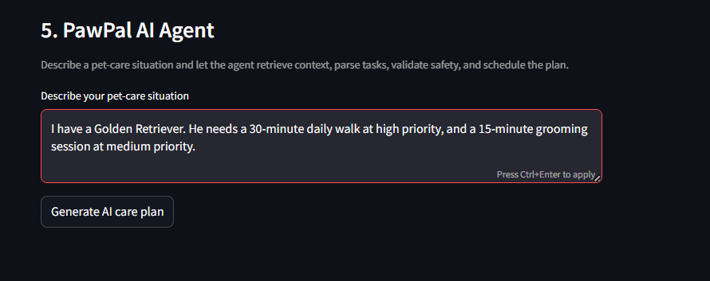
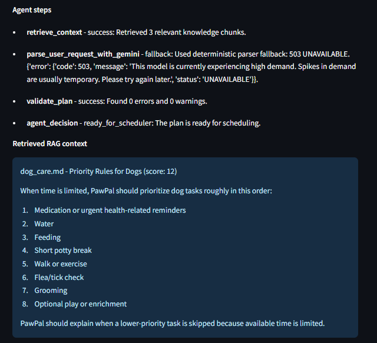
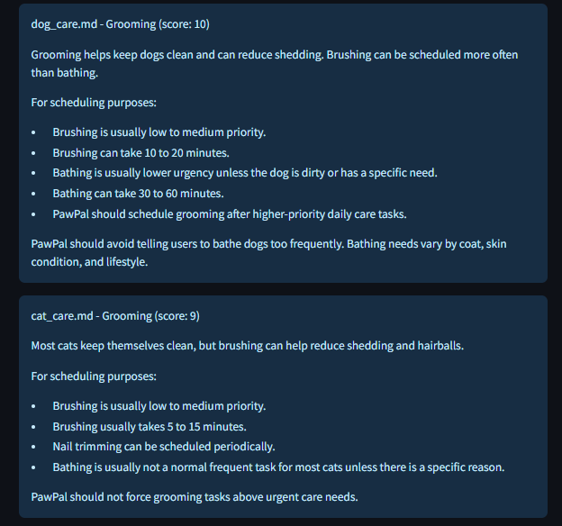
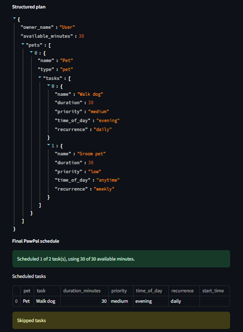
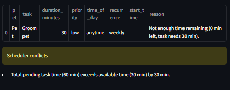
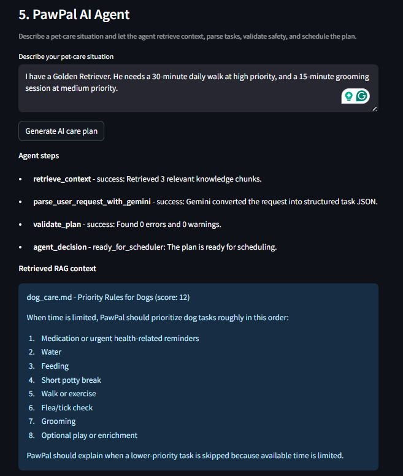
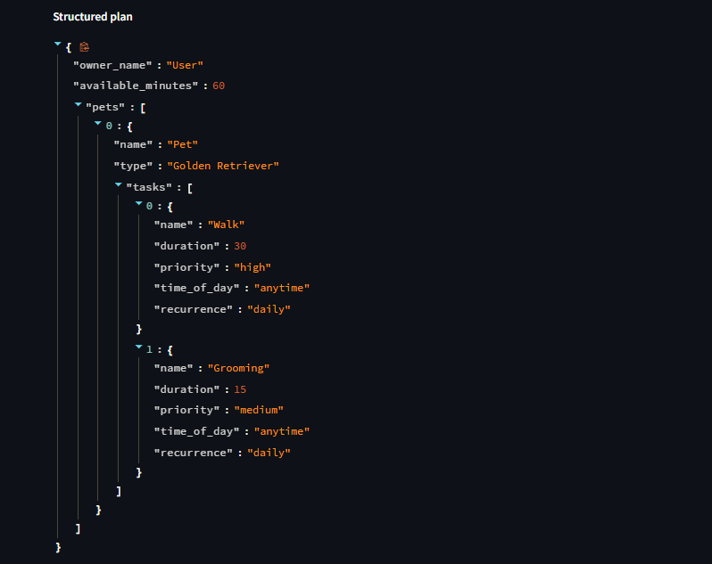
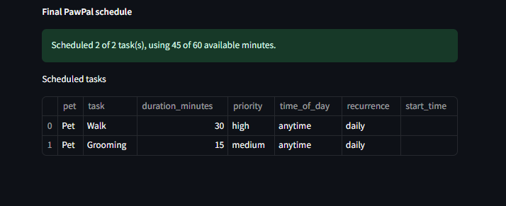

#### Test Case 2️⃣: Medical Warning (Guardrails)
**Input:** `"My dog needs his antibiotic medication for an infected wound."`

**Screenshot shows:**
- Yellow warning: "This app is for scheduling support only..."
- Medical disclaimer appears due to keywords: antibiotic, medication, wound

[Paste screenshot URL or relative path here]

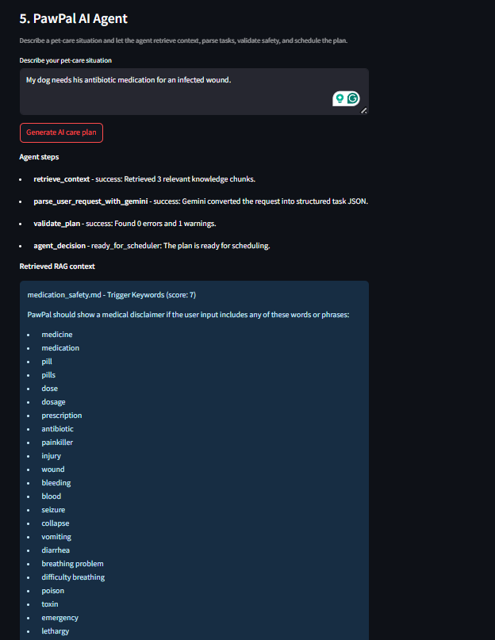
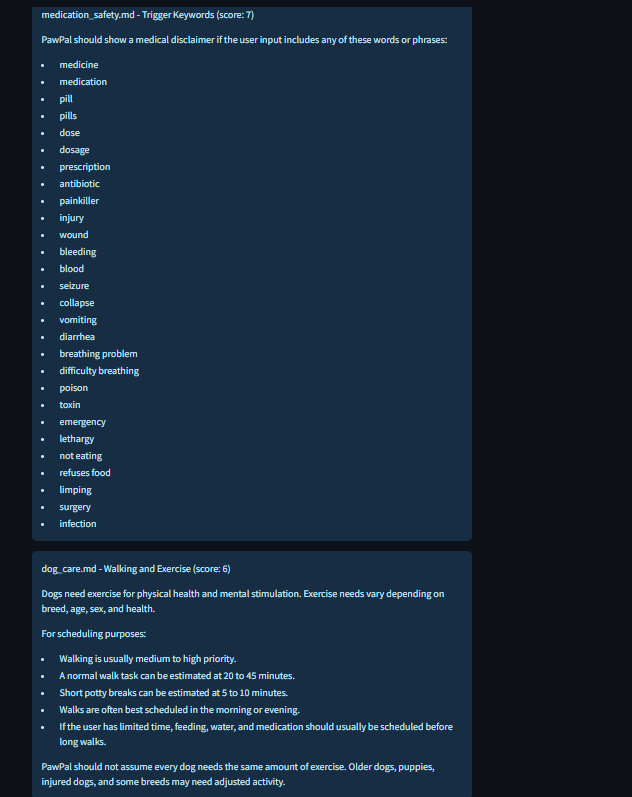
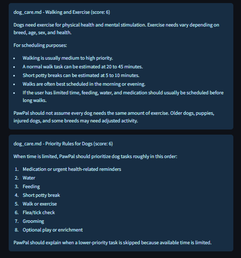
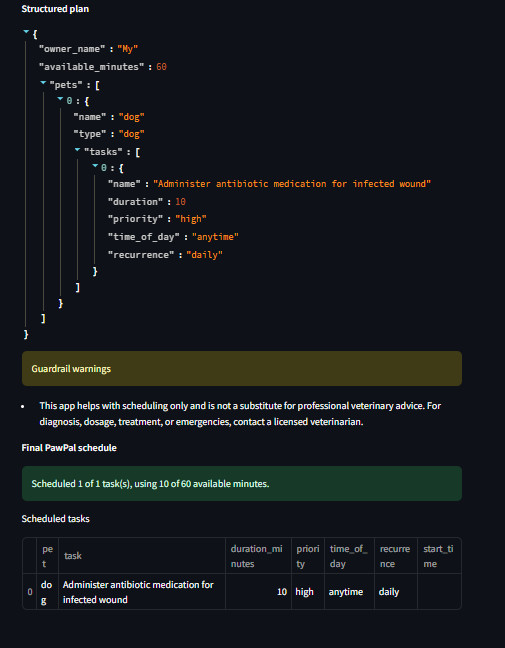

#### Test Case 3️⃣: Emergency Alert (Guardrails)
**Input:** `"Help, my dog is having a severe seizure and is bleeding."`

**Screenshot shows:**
- Red emergency warning: "Please contact a veterinarian or emergency clinic immediately."
- Emergency keywords detected: seizure, bleeding

[Paste screenshot URL or relative path here]
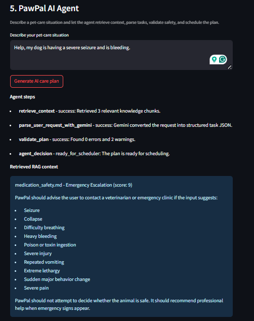
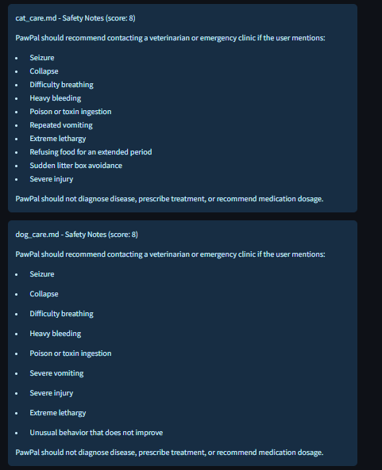
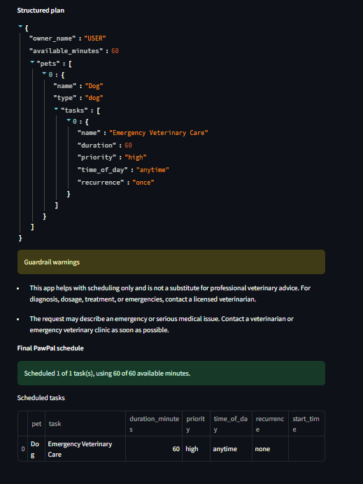

#### Test Case 4: Multi-Pet Prioritization Under Time Limit
**Input:** `"I have two pets: a dog named Max and a cat named Luna. I only have 50 minutes today. Max needs a 30-minute walk, feeding, and playtime. Luna needs feeding, litter box cleaning, and 20 minutes of grooming. Feeding and litter cleaning are high priority; grooming is low priority."`

**Screenshot should show:**
- Gemini parses multiple pets and multiple tasks into structured JSON
- High-priority feeding and litter cleaning tasks appear before lower-priority grooming
- The scheduler fits the most important tasks within the 50-minute limit
- At least one lower-priority or longer task may be skipped if it does not fit
- Final schedule includes tasks for both Max and Luna when possible

[Paste screenshot URL or relative path here]
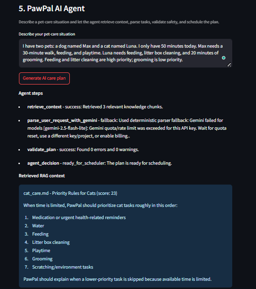
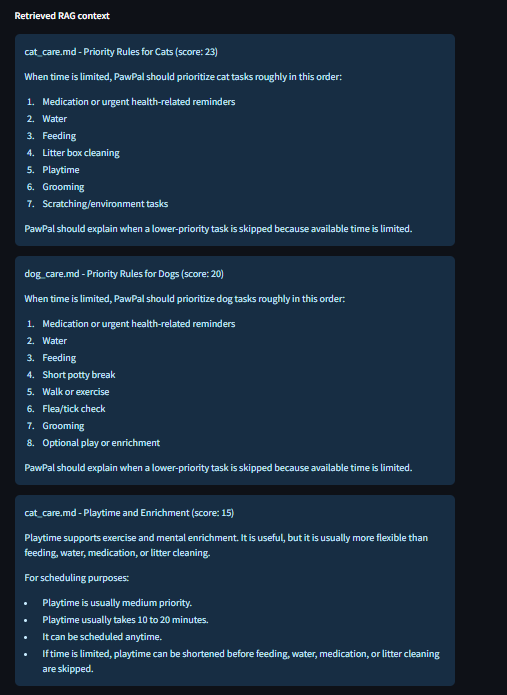
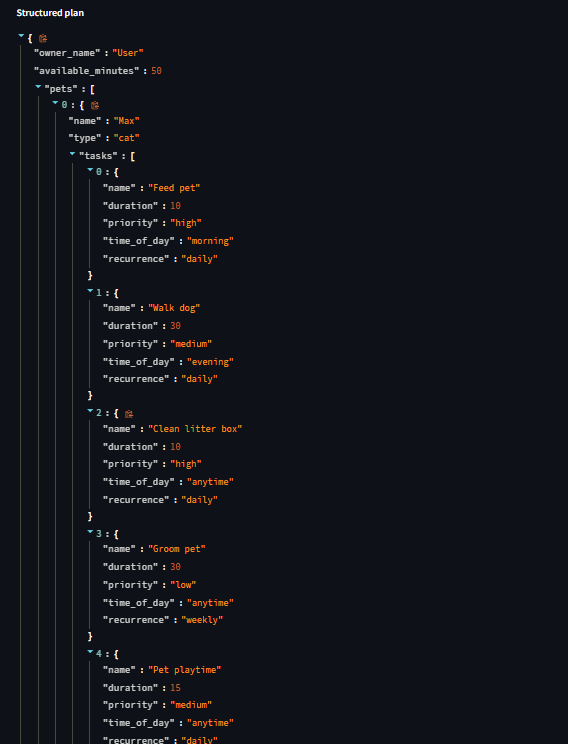
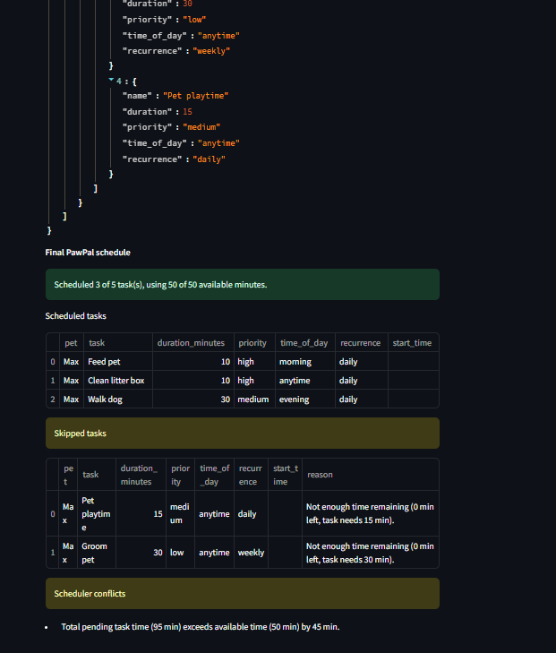
