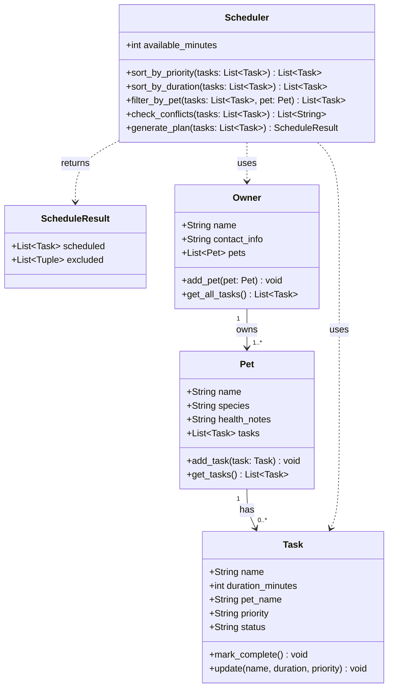

# PawPal+ Project Reflection

## 1. System Design

**a. Initial design**

- Briefly describe your initial UML design.

The system is designed around three core actions a user needs to perform:

1. **Add a pet to the system.** The user enters basic information about themselves and their pet (such as the pet's name, species, and any relevant health notes). This gives the app the context it needs to personalize care recommendations and store tasks associated with that specific pet.

2. **Add and manage care tasks.** The user can create individual care tasks — such as a morning walk, medication, feeding, or grooming — and assign each task a duration (in minutes) and a priority level. This lets the system understand what needs to happen and how urgently, so it can make sensible scheduling decisions even when time is limited.

3. **Generate and view a daily care plan.** The user requests a daily schedule, and the app produces an ordered plan of tasks based on the available time and each task's priority. The plan is displayed clearly, with an explanation of why tasks were included or excluded, so the owner understands the reasoning and can trust the schedule.

- What classes did you include, and what responsibilities did you assign to each?

I chose four classes, each with a single clear responsibility:

| Class | Responsibility |
|---|---|
| **Task** | Holds all data for a single care item (name, duration, priority, status) and knows how to mark itself complete or update its fields. |
| **Pet** | Represents one animal. Owns a list of Tasks and exposes methods to add a new task or retrieve the current task list. |
| **Owner** | Represents the person using the app. Owns a list of Pets and can add a new pet or collect every task across all pets into one flat list. |
| **Scheduler** | The planning brain. Takes a flat task list and produces a daily schedule by sorting on priority/duration, filtering by pet if needed, and flagging any time conflicts. |

**b. Design changes**

Yes, reviewing the skeleton against the README revealed two gaps that required changes before implementation began:

**Change 1 — Added `pet_name: str` to `Task`**

The original `Task` dataclass had no field linking it back to its pet. `Scheduler.filter_by_pet()` accepts a flat task list and a `Pet` object, but without a `pet_name` on each task there was no way to filter without cross-referencing every `pet.tasks` list. Adding `pet_name` as a field on `Task` makes filtering a simple string comparison and removes the hidden dependency on object identity.

**Change 2 — Added `ScheduleResult` dataclass; changed `generate_plan` return type**

The original `generate_plan` returned `list[Task]` (only the scheduled tasks). The README explicitly says the app should *explain why* it chose the plan. Returning a plain list silently discards all reasoning. A new `ScheduleResult` dataclass was introduced to hold both `scheduled: list[Task]` and `excluded: list[tuple[Task, str]]` (each excluded task paired with a human-readable reason). `generate_plan` now returns a `ScheduleResult` so the UI layer can display the full explanation.

---

## 2. Scheduling Logic and Tradeoffs

**a. Constraints and priorities**

- What constraints does your scheduler consider (for example: time, priority, preferences)?
- How did you decide which constraints mattered most?

**b. Tradeoffs**

- Describe one tradeoff your scheduler makes.
- Why is that tradeoff reasonable for this scenario?

---

## 3. AI Collaboration

**a. How you used AI**

- How did you use AI tools during this project (for example: design brainstorming, debugging, refactoring)?
- What kinds of prompts or questions were most helpful?

**b. Judgment and verification**

- Describe one moment where you did not accept an AI suggestion as-is.
- How did you evaluate or verify what the AI suggested?

---

## 4. Testing and Verification

**a. What you tested**

- What behaviors did you test?
- Why were these tests important?

**b. Confidence**

- How confident are you that your scheduler works correctly?
- What edge cases would you test next if you had more time?

---

## 5. Reflection

**a. What went well**

- What part of this project are you most satisfied with?

**b. What you would improve**

- If you had another iteration, what would you improve or redesign?

**c. Key takeaway**

- What is one important thing you learned about designing systems or working with AI on this project?
